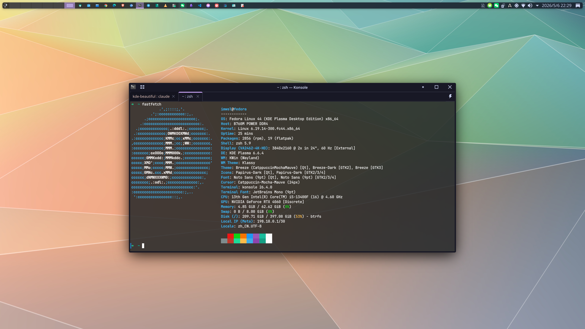

# kde-beautiful

[](./LICENSE)
[](https://github.com/imwsl/kde-beautiful/stargazers)
[](https://fedoraproject.org)
[](https://kde.org/plasma-desktop)

在 Fedora KDE Plasma 桌面上一键应用 **Catppuccin Mocha Mauve** 主题套件。



## 效果包含

| 组件 | 内容 |
|------|------|
| 全局主题 | Catppuccin Mocha Mauve（主题色、配色方案、光标） |
| 窗口装饰 | Klassy |
| 图标 | Papirus-Dark + Catppuccin Mauve 文件夹色 |
| 登录界面 | Catppuccin Mocha Mauve SDDM 主题 |
| 终端 | Ghostty + Catppuccin Mocha + AdwaitaMono Nerd Font |
| 合成器 | KWin 三缓冲、模糊、Magic Lamp 动画等 |

## 前置条件

**系统环境**

- Fedora Linux（或其他 RPM 系发行版），使用 `dnf` 包管理器
- KDE Plasma 5 或 6 桌面环境
- **必须在已登录的 KDE 图形会话中运行**，脚本依赖 `lookandfeeltool` 应用主题、通过 D-Bus 重载 KWin，在 TTY 或 SSH 中执行会跳过这两步

**权限**

- 以普通用户身份运行，**不要用 root**；脚本内部会在需要时自动调用 `sudo`
- 需要 `sudo` 权限用于：安装 dnf 包、写入 `/usr/share/sddm/themes/`、创建 `/etc/sddm.conf.d/theme.conf`

**网络**

- 能够访问 **GitHub**（下载主题、字体、SDDM 包）
- 能够访问 **Fedora COPR**（安装 Klassy 窗口装饰和 Ghostty 终端）

**系统工具**（标准 KDE Plasma 安装中均已包含，无需手动安装）

| 工具 | 用途 |
|------|------|
| `fc-cache` | 刷新字体缓存（来自 `fontconfig`） |
| `kwriteconfig5` | 写入 KWin 合成器配置（来自 `kf5-kconfig`） |
| `lookandfeeltool` | 应用全局主题（来自 `plasma-workspace`） |
| `dbus-send` | 通知 KWin 重载配置（来自 `dbus`） |

**注意事项**

- 脚本会**直接覆盖** `~/.config/ghostty/config`，如已有自定义配置请提前备份
- Ghostty 配置中 `shell-integration = zsh`，默认适配 zsh；使用其他 Shell 需安装后手动修改

## 安装

```bash
git clone https://github.com/yangjie6020/kde-beautiful.git
cd kde-beautiful
chmod +x kde-catppuccin-setup.sh
./kde-catppuccin-setup.sh
```

脚本全程无交互，完成后会提示需要手动确认的步骤。

## 安装完成后

脚本结束时会列出以下手动确认项（部分设置需在图形界面中点选）：

1. **系统设置 → 外观 → 全局主题** → 选择 `Catppuccin-Mocha-Mauve`
2. **系统设置 → 外观 → 图标** → 选择 `Papirus-Dark`
3. **系统设置 → 外观 → 光标** → 选择 `Catppuccin-Mocha-Mauve-Cursors`
4. **系统设置 → 窗口装饰** → 选择 `Klassy`
5. 注销或重启以使所有更改完全生效

## 致谢

- [Catppuccin](https://github.com/catppuccin) — 主题配色方案
- [Klassy](https://github.com/paulmcauley/klassy) — 窗口装饰
- [Papirus](https://github.com/PapirusDevelopmentTeam/papirus-icon-theme) — 图标主题
- [Ghostty](https://ghostty.org) — 终端模拟器
- [Nerd Fonts](https://github.com/ryanoasis/nerd-fonts) — AdwaitaMono 字体

## 许可证

[MIT](./LICENSE)
